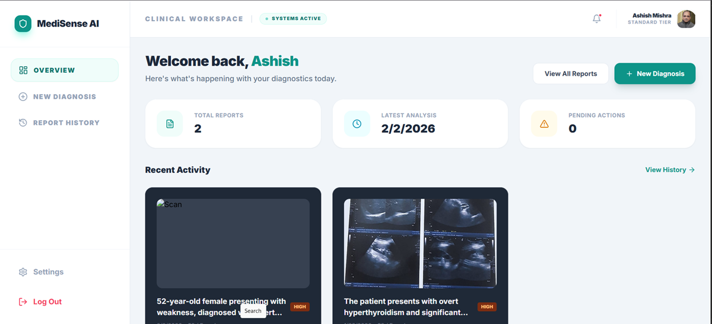
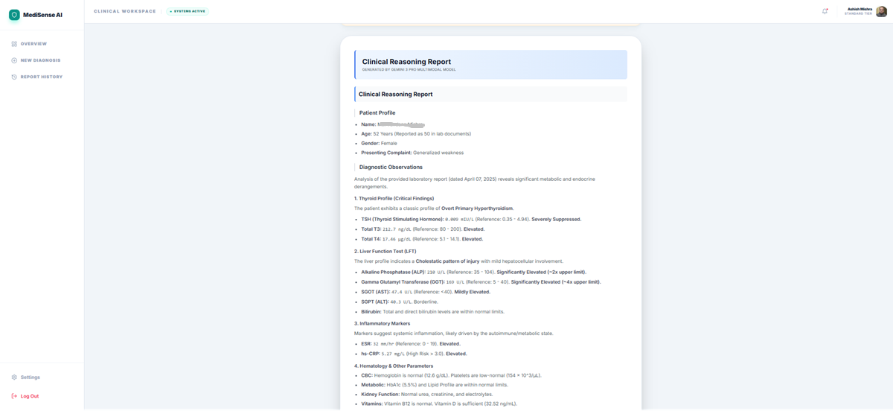

# 🏥 MediSense AI - Multimodal Medical Diagnosis Assistant

 


> 🎯 **Transform medical diagnostics with AI-powered multimodal analysis** - upload scans, speak symptoms, get instant preliminary assessments powered by Gemini 3.

Built for the **Gemini 3 Hackathon** | [Live Demo](#) | [Devpost](https://devpost.com/software/medisense-ai)

---

## 🌟 Overview

MediSense AI is a comprehensive multimodal medical diagnostic assistant that combines **image analysis**, **voice recognition**, and **structured patient data** to generate evidence-based preliminary health assessments using Google's Gemini 3 Pro.

### ✨ Key Features

- 📸 **Multimodal Input**: Upload medical images, capture photos, or record voice descriptions
- 🧠 **AI-Powered Analysis**: Gemini 3 Pro generates detailed clinical reasoning reports
- 🎯 **Smart Triage**: Automatic urgency classification (Low/Medium/High/Emergency)
- 📊 **Professional Reports**: Export-ready medical documentation with visual hierarchy
- 🔒 **Secure & Private**: Firebase authentication with encrypted cloud storage
- 🌓 **Dark Mode**: Full theme support for late-night clinical reviews
- 📱 **Responsive**: Works seamlessly on desktop, tablet, and mobile

---

## 🚀 Quick Start

### Prerequisites
- Node.js 18+ 
- npm or yarn
- Gemini API key ([Get one here](https://ai.google.dev/))
- Firebase project ([Create one here](https://console.firebase.google.com/))

### Installation

```bash
# Clone the repository
git clone https://github.com/amishra06/medisense-ai.git
cd medisense-ai

# Install dependencies
npm install

# Set up environment variables
cp .env.example .env.local

# Add your API keys to .env.local:
# VITE_GEMINI_API_KEY=your_gemini_key_here
# VITE_FIREBASE_API_KEY=your_firebase_key_here
# (see .env.example for all required variables)

# Start development server
npm run dev
```

Visit `http://localhost:5173` and start diagnosing! 🎉

---

## 🛠️ Tech Stack

### Frontend
- **React 18** + **TypeScript** - Type-safe component architecture
- **Vite** - Lightning-fast dev server and builds
- **TailwindCSS** - Utility-first styling
- **Framer Motion** - Smooth animations
- **React Router** - Client-side navigation

### AI & Backend
- **Gemini 3 Pro API** - Multimodal AI analysis
- **Firebase Auth** - Secure Google OAuth
- **Cloud Firestore** - Real-time database
- **Firebase Storage** - Media file storage

### Key Libraries
```json
{
  "@google/genai": "^1.38.0",
  "firebase": "^11.0.0",
  "react-markdown": "^9.0.0",
  "framer-motion": "^11.0.0",
  "lucide-react": "^0.344.0",
  "jspdf": "^4.0.0"
}
```

---

## 📱 Features Showcase

### 1. Multimodal Input Processing
- Upload medical images (X-rays, ultrasounds, CT scans, lab reports)
- Live camera capture with auto-orientation
- Voice recording with AI transcription
- Structured patient data forms

### 2. Advanced AI Analysis
- Gemini 3 Pro analyzes all inputs simultaneously
- Generates comprehensive clinical reasoning reports
- Differential diagnosis with confidence levels
- Evidence-based recommendations grounded in medical literature

### 3. Clinical-Grade Reports
```
✅ Visual hierarchy with clear section headers
✅ Table support for lab results
✅ Status badges (Suppressed/Low/High/Critical)
✅ Red flag identification
✅ Next steps recommendations
✅ Grounding sources from medical literature
```

### 4. Secure Data Management
- End-to-end encryption
- Configurable data retention (30/90/180/365 days)
- Manual cleanup options
- HIPAA-compliant design principles

---

## 🎨 Screenshots

### Dashboard Overview


### Clinical Report



---
## 📖 Usage Guide

### Creating a New Diagnosis

1. **Click "New Diagnosis"** from the dashboard
2. **Add Patient Information**:
   - Manual entry OR voice recording (AI extracts data)
3. **Upload Medical Data**:
   - Drag & drop images
   - Capture live photos
   - Upload PDFs/documents
4. **Analyze**: Click "Analyze with AI"
5. **Review Report**: Get instant preliminary assessment
6. **Save & Share**: Export PDF or share via QR code

### Voice Input Example
```
"Patient is a 62-year-old female presenting with 
weakness, skin rashes, generalized itching, and 
restlessness for the past 2 weeks..."
```
AI automatically extracts:
- Age: 62
- Gender: Female
- Symptoms: weakness, skin rashes, itching, restlessness
- Duration: 2 weeks

---

## 🏗️ Project Structure

```
medisense-ai/
├── components/           # React components
│   ├── Auth.tsx         # Authentication UI
│   ├── Dashboard.tsx    # Main dashboard layout
│   ├── NewDiagnosis.tsx # Diagnosis creation
│   ├── ResultDisplay.tsx # Report rendering
│   ├── Settings.tsx     # User preferences
│   └── ...
├── services/            # API integrations
│   ├── geminiService.ts # Gemini API calls
│   └── firebaseService.ts # Firebase operations
├── src/
│   ├── contexts/        # React contexts
│   │   └── ThemeContext.tsx
│   └── types.ts         # TypeScript definitions
├── public/              # Static assets
└── index.html          # Entry point
```

---

## 🔐 Security & Privacy

- ✅ **Firebase Authentication** - Secure Google OAuth
- ✅ **Data Encryption** - All data encrypted at rest
- ✅ **HTTPS Only** - TLS 1.3 encryption in transit
- ✅ **Access Control** - Users can only access their own data
- ✅ **Data Retention** - Configurable automatic cleanup
- ✅ **No Analytics** - Optional, opt-in only

---

## 🚧 Roadmap

### Phase 1 - MVP ✅
- [x] Multimodal input (images, voice, text)
- [x] Gemini 3 integration
- [x] Clinical report generation
- [x] Firebase authentication & storage
- [x] Dark mode support

### Phase 2 - Enhancement 🚀
- [ ] Multi-image comparative analysis
- [ ] Treatment plan generation
- [ ] Appointment scheduling integration
- [ ] Multi-language support (ES, HI, ZH)
- [ ] Offline PWA mode

### Phase 3 - Enterprise 🏢
- [ ] EHR system integration
- [ ] Role-based access control
- [ ] Analytics dashboard
- [ ] Batch processing API
- [ ] FDA 510(k) pathway

---

## 🤝 Contributing

We welcome contributions! Please see [CONTRIBUTING.md](CONTRIBUTING.md) for guidelines.

### Development Setup
```bash
# Fork the repo
git clone https://github.com/amishra06/medisense-ai.git
cd medisense-ai

# Create a feature branch
git checkout -b feature/amazing-feature

# Make your changes
npm run dev

# Run tests
npm test

# Commit and push
git commit -m "Add amazing feature"
git push origin feature/amazing-feature

# Open a Pull Request
```

---

## 📄 License

MIT License - See [LICENSE](LICENSE) for details

---

## ⚠️ Medical Disclaimer

**MediSense AI is an educational tool for preliminary analysis only.** 

- ❌ NOT a licensed medical device
- ❌ NOT a replacement for professional medical advice
- ❌ NOT for emergency situations

**Always consult qualified healthcare providers for medical decisions.**

In case of emergency, call 911 or visit your nearest emergency department immediately.

---

## 🙏 Acknowledgments

- **Google Gemini Team** - For the incredible Gemini 3 Pro API
- **Firebase Team** - For robust cloud infrastructure
- **Open Source Community** - For essential libraries
- **Medical Professionals** - For invaluable feedback

---

## 📧 Contact

- **Project Link**: [https://github.com/amishra06/medisense-ai](https://github.com/amishra06/medisense-ai)
- **Email**: [amishra6173@gmail.com]

---

<div align="center">

**Built with ❤️ for the Gemini 3 Hackathon**

[⬆ Back to Top](#-medisense-ai---multimodal-medical-diagnosis-assistant)

</div>
